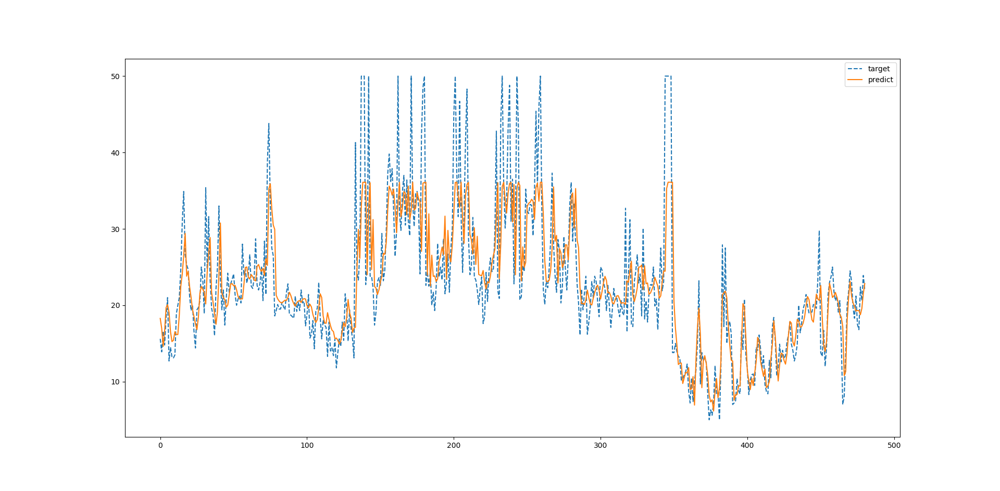

# PyTorch

## 多层全连接神经网络

### PyTorch 基础

#### Tensor（张量）

```python
import torch
import numpy as np

n = np.random.randint(0, 9, size=[3, 4])

# torch.Tensor 默认的是torch.FloatTensor 数据类型

t = torch.Tensor(n)

print(t)

print(t.size())

# tensor([[0., 4., 8., 3.],
#         [8., 0., 4., 1.],
#         [2., 5., 6., 8.]])

# torch.Size([3, 4])
```

```python
n = np.random.randint(0, 9, size=[3, 4])

t = torch.IntTensor(n)
```

```python
t = torch.zeros(size=[2, 3])

print(t)

t = torch.randn(size=[2 ,3])

print(t)

# tensor([[0., 0., 0.],
#         [0., 0., 0.]])
# 
# tensor([[ 0.2019,  0.9128, -0.9776],
#         [ 1.0295, -0.5504,  1.4908]])
```

```python
t = torch.randn(size=[2 ,3])

t[1, 2] = 0.14

print(t[1, 2])

# tensor(0.1400)
```

```python
t = torch.randn(size=[2 ,3])

n = t.numpy()

print(n)

# [[ 0.78699595 -0.40166107  1.3234713 ]
#  [ 1.1844031   1.035409    1.2477363 ]]

t = torch.from_numpy(n)

print(t)

# tensor([[ 0.6715,  0.0171,  1.4170],
#         [-0.4529, -0.0961,  0.5438]])
```

#### Variable（变量）

```python
from torch.autograd import Variable
import torch

size = [3]
x = Variable(torch.ones(size=size), requires_grad=True)
w = Variable(torch.ones(size=size), requires_grad=True)
b = Variable(torch.ones(size=size), requires_grad=True)

y = w * x ** 2 + b

gradients = torch.Tensor(torch.FloatTensor([1, 0.1, 0.01]))

# 得到的梯度就是它们原本的梯度分别乘上 1 ,0.1 和0.01

y.backward(gradients)

print(x.grad)

print(w.grad)

print(b.grad)

# tensor([2.0000, 0.2000, 0.0200])
# tensor([1.0000, 0.1000, 0.0100])
# tensor([1.0000, 0.1000, 0.0100])

```

#### Dataset（数据集）

```python
from torch.utils.data import Dataset, DataLoader
import pandas as pd


class MyDataset(Dataset):
    def __init__(self, csv_file, txt_file, root_dir, other_file):
        self.scv_data = pd.read_csv(csv_file)
        with open(txt_file, 'r') as f:
            data_list = f.readlines()

        self.txt_data = data_list
        
        self.root_dir = root_dir
        
    def __len__(self):
        return len(self.scv_data)
    
    def __getitem__(self, index):
        data = (self.scv_data[index], self.txt_data[index])
        return data
    
    
myDataset = MyDataset(
    csv_file='...', txt_file='...', root_dir='...', other_file='...'
)
dataiter = DataLoader(myDataset, batch_size=32, shuffle=True)
```

#### nn.Module (模组)

```python
from torch import nn

class Net(nn.Module):
    def __init__(self):
        super(Net, self).__init__()
        self.conv = nn.Conv2d(
            in_channels=1, out_channels=3, kernel_size=5
        )

    def forward(self, x):
        return self.conv(x)
```

#### torch.optim (优化)

```python
from torch import optim

net = Net()
opt = optim.SGD(net.parameters(), lr=0.01, momentum=0.9)
```

#### 模型的保存与加载

```python
torch.save(net, 'model.pth')

net = torch.load('model.pth')
```

### 回归模型

#### 线性模型

```python
from sklearn import datasets
import matplotlib.pyplot as plt
import seaborn
import torch
from torch import nn
from torch import optim
from torch.autograd import Variable
import numpy as np

seaborn.set()

n_samples = 100

x, y = datasets.make_regression(
    n_samples=n_samples, n_features=1, n_targets=1, noise=2
)


x = torch.Tensor(x.reshape((n_samples, 1)))
y = torch.Tensor(y.reshape((n_samples, 1)))


class LinearRegression(nn.Module):
    def __init__(self):
        super(LinearRegression, self).__init__()
        self.linear = nn.Linear(in_features=1, out_features=1)

    def forward(self, x):
        return self.linear(x)


regression = LinearRegression()

if torch.cuda.is_available():
    regression = LinearRegression().cuda()
else:
    regression = LinearRegression()

criterion = nn.MSELoss()
opt = optim.SGD(regression.parameters(), lr=0.01)

if torch.cuda.is_available():
    inputs = Variable(x).cuda()
    target = Variable(y).cuda()
else:
    inputs = Variable(x)
    target = Variable(y)

epochs = 100

for epoch in range(epochs):
    out = regression(inputs)

    loss = criterion(out, target)

    opt.zero_grad()
    loss.backward()
    opt.step()

    if epoch % 5 == 0:
        print('Epoch {} : {}'.format(epoch + 1, loss / n_samples))

val = np.linspace(-4, 4, n_samples).reshape((n_samples, 1))
tar = regression(Variable(torch.Tensor(val))).data.numpy()

plt.plot(val, tar)
plt.scatter(x, y)
plt.show()
```


#### 非线性回归

```python
from torch import nn, Tensor, optim
from sklearn.datasets import load_boston
from sklearn.preprocessing import MinMaxScaler
from sklearn.metrics import r2_score, mean_squared_error
import numpy as np
import matplotlib.pyplot as plt

boston = load_boston()
data = boston.data
target = boston.target[:, np.newaxis]

# print(data.shape, target.shape) (506, 13) (506, 1)

scaler = MinMaxScaler()

data = scaler.fit_transform(data)
target = scaler.fit_transform(target)


class Net(nn.Module):
    def __init__(self):
        super(Net, self).__init__()

        self.layer1 = nn.Sequential(
            nn.Linear(13, 36),
            nn.ReLU()
        )

        self.layer2 = nn.Sequential(
            nn.Linear(in_features=36, out_features=1),
            nn.ReLU()
        )

    def forward(self, i):
        i = self.layer1(i)
        return self.layer2(i)


net = Net()
opt = optim.Adam(net.parameters(), lr=0.01)
criterion = nn.MSELoss()

data_t = Tensor(data)
target_t = Tensor(target)

epochs = 250

for epoch in range(epochs):
    o = net(data_t)
    loss = criterion(o, target_t)

    opt.zero_grad()
    loss.backward()
    opt.step()

    print(loss)

acc = r2_score(y_true=target, y_pred=o.detach().numpy(), multioutput="variance_weighted")
mse = mean_squared_error(y_true=target, y_pred=o.detach().numpy())

plt.plot(target, linestyle='--', label='taget')
plt.plot(o.detach().numpy(), label='predict')
plt.legend()
plt.title('acc : {:0.3}, mse : {:0.3}'.format(acc, mse))
plt.show()

```


### 分类模型

```python
from sklearn.datasets import load_iris
import torch
from torch import nn
from torch import optim
from torch.autograd import Variable
import numpy as np

iris = load_iris()

data = iris.data
target = iris.target

x = Variable(torch.Tensor(data))
# torch.Size([150, 4])

y = Variable(torch.Tensor(target)).long()
# torch.Size([150])


class Classification(nn.Module):
    def __init__(self):
        super(Classification, self).__init__()
        self.layer = nn.Linear(in_features=4, out_features=3)

    def forward(self, x):
        x = self.layer(x)
        return x


classification = Classification()

opt = optim.SGD(classification.parameters(), lr=0.01)
criterion = nn.CrossEntropyLoss()
epochs = 500

for epoch in range(epochs):
    out = classification(x)

    loss = criterion(out, y)

    opt.zero_grad()
    loss.backward()
    opt.step()


out = out.data.numpy().argmax(axis=1)

acc = np.sum(out == target) / len(target)

print('accuracy : {}'.format(acc))

```

## 卷积神经网络

### mnist

```python
# -*- encoding: utf-8 -*-

# @Time    :  2019/5/14 20:36

import torch
from torch import nn
from torch import optim
import numpy as np
from torch.utils.data import DataLoader
import torchvision

batch_size = 32
epochs = 64

train_data = torchvision.datasets.MNIST(
    root='../data/mnist', train=True, transform=torchvision.transforms.ToTensor(), download=True
)

test_data = torchvision.datasets.MNIST(
    root='../data/mnist', train=False
)

train_loader = DataLoader(dataset=train_data, batch_size=32, shuffle=True)

test_x = test_data.data
# torch.Size([10000, 28, 28])

test_x = torch.unsqueeze(test_x, dim=1).type(torch.FloatTensor)
# torch.Size([10000, 1, 28, 28])

test_x = test_x[: batch_size * 100] / 255

test_y = test_data.targets[: batch_size * 100]


# print(test_x.shape, test_y.shape) torch.Size([3200, 1, 28, 28]) torch.Size([3200])


class CNN(nn.Module):
    def __init__(self):
        super(CNN, self).__init__()

        self.conv1 = nn.Sequential(
            nn.Conv2d(
                in_channels=1,
                out_channels=16,
                kernel_size=5,
                stride=1,
                padding=2  # padding=(kernel_size-1)/2
            ),
            nn.ReLU(),
            nn.MaxPool2d(kernel_size=2)
        )

        self.conv2 = nn.Sequential(
            nn.Conv2d(
                in_channels=16,
                out_channels=32,
                kernel_size=5,
                stride=1,
                padding=2
            ),
            nn.ReLU(),
            nn.MaxPool2d(kernel_size=2)
        )

        self.out = nn.Sequential(
            nn.Linear(32 * 7 * 7, 10),
            nn.Sigmoid()
        )

    def forward(self, x):
        x = self.conv1(x)
        x = self.conv2(x)
        x = x.view(x.size(0), -1)
        return self.out(x)


cnn = CNN()

opt = optim.Adam(cnn.parameters(), lr=0.01)

criterion = nn.CrossEntropyLoss()


for epoch in range(epochs):
    for step, (x, y) in enumerate(train_loader):
        
        # x.size() torch.Size([batch_size, 1, 28, 28])
        
        # y.size() torch.Size([batch_size])

        out = cnn(x)

        loss = criterion(out, y)

        opt.zero_grad()

        loss.backward()

        opt.step()

        # test

        out = cnn(test_x)

        out_num = out.data.numpy()
        y_num = test_y.numpy()

        out_num = out_num.argmax(axis=1)

        acc = np.sum(out_num == y_num) / len(y_num)

        print('Epoch {} / {} - acc : {} - loss : {}'.format(epoch +1 , step + 1, acc, loss.detach().numpy()))


```

## 循环神经网络

### Sin

```python
# -*- encoding: utf-8 -*- 

# @Time    :  2019/5/15 17:55

import torch
from torch import nn
import numpy as np
import matplotlib.pyplot as plt
import seaborn

seaborn.set()

hidden_size = 2
num_layers = 4
input_size = 8
batch = 16
seq = 32

lstm = nn.RNN(input_size=input_size, hidden_size=hidden_size, num_layers=num_layers)

# input size 表示输入 x(t) 的特征维度
# hidden_size 表示输出 h(t) 的特征维度
# num_layers 表示网络层数


# 超参设置

time_step = 20  # RNN时间步长
batch_size = 1  # RNN输入尺寸
lr = 0.02  # 初始学习率
n_epochs = 100  # 训练回数


class LSTM(nn.Module):
    def __init__(self):
        super(LSTM, self).__init__()
        self.lstm = nn.LSTM(
            input_size=1,
            hidden_size=32,
            num_layers=1,
        )
        self.out = nn.Linear(32, 1)

    def forward(self, x, h):
        # x (time_step, batch_size, input_size)
        # h (n_layers, batch, hidden_size)
        # out (time_step, batch_size, hidden_size)
        out, h = self.lstm(x, h)
        prediction = self.out(out)
        return prediction, h


lstm = LSTM()

optimizer = torch.optim.Adam(lstm.parameters(), lr=lr)
loss_func = nn.MSELoss()
h_state = None  # 初始化隐藏层

plt.figure()
plt.ion()

for step in range(n_epochs):
    start, end = step * np.pi, (step + 1) * np.pi  # 时间跨度
    # 使用Sin函数预测Cos函数
    steps = np.linspace(start, end, time_step, dtype=np.float32, endpoint=False)

    x_np = np.sin(steps)
    y_np = np.cos(steps)

    # print(x_np.shape, y_np.shape) (20,) (20,)

    x = torch.from_numpy(x_np[:, np.newaxis, np.newaxis])  # 尺寸大小为(time_step, batch, input_size)
    y = torch.from_numpy(y_np[:, np.newaxis, np.newaxis])

    # print(x.shape, y.shape) torch.Size([20, 1, 1]) torch.Size([20, 1, 1])

    prediction, h_state = lstm(x, h_state)

    # print(type(h_state), type(h_state[0]), type(h_state[0].detach()))

    # <class 'tuple'> < class 'torch.Tensor' > < class 'torch.Tensor' >

    # print(h_state[0].size()) torch.Size([1, 1, 32])

    h_state = (h_state[0].detach(), h_state[1].detach())

    # print(type(h_state)) <class 'tuple'>

    loss = loss_func(prediction, y)
    optimizer.zero_grad()
    loss.backward()
    optimizer.step()

    # 绘制中间结果
    
    # plt.cla()
    plt.plot(steps, y_np.flatten(), 'r-', linestyle='--')
    plt.plot(steps, prediction.data.numpy().flatten(), 'b-')
    plt.draw()
    plt.pause(0.2)

plt.ioff()
plt.show()

```

```python
# -*- encoding: utf-8 -*- 

# @Time    :  2019/5/14 20:36
import torch
from torch import nn
import numpy as np
import matplotlib.pyplot as plt
import seaborn

seaborn.set()

hidden_size = 2
num_layers = 4
input_size = 8
batch = 16
seq = 32

rnn = nn.RNN(input_size=input_size, hidden_size=hidden_size, num_layers=num_layers)

# input size 表示输入 x(t) 的特征维度
# hidden_size 表示输出 h(t) 的特征维度
# num_layers 表示网络层数


# 超参设置

time_step = 20  # RNN时间步长
batch_size = 1  # RNN输入尺寸
lr = 0.02  # 初始学习率
n_epochs = 100  # 训练回数


class RNN(nn.Module):
    def __init__(self):
        super(RNN, self).__init__()
        self.rnn = nn.LSTM(
            input_size=1,
            hidden_size=32,
            num_layers=1,
        )
        self.out = nn.Linear(32, 1)

    def forward(self, x, h):
        # x (time_step, batch_size, input_size)
        # h (n_layers, batch, hidden_size)
        # out (time_step, batch_size, hidden_size)
        out, h = self.rnn(x, h)
        prediction = self.out(out)
        return prediction, h


rnn = RNN()

optimizer = torch.optim.Adam(rnn.parameters(), lr=lr)
loss_func = nn.MSELoss()
h_state = None  # 初始化隐藏层

plt.figure()
plt.ion()

for step in range(n_epochs):
    start, end = step * np.pi, (step + 1) * np.pi  # 时间跨度
    # 使用Sin函数预测Cos函数
    steps = np.linspace(start, end, time_step, dtype=np.float32, endpoint=False)

    x_np = np.sin(steps)
    y_np = np.cos(steps)

    # print(x_np.shape, y_np.shape) (20,) (20,)

    x = torch.from_numpy(x_np[:, np.newaxis, np.newaxis])  # 尺寸大小为(time_step, batch, input_size)
    y = torch.from_numpy(y_np[:, np.newaxis, np.newaxis])

    # print(x.shape, y.shape) torch.Size([20, 1, 1]) torch.Size([20, 1, 1])

    prediction, h_state = rnn(x, h_state)

    # print(type(h_state), type(h_state[0]), type(h_state[0].detach()))

    # <class 'tuple'> < class 'torch.Tensor' > < class 'torch.Tensor' >

    # print(h_state[0].size()) torch.Size([1, 1, 32])

    h_state = (h_state[0].detach(), h_state[1].detach())

    # print(type(h_state)) <class 'tuple'>

    loss = loss_func(prediction, y)
    optimizer.zero_grad()
    loss.backward()
    optimizer.step()

    # 绘制中间结果
    # plt.cla()
    plt.plot(steps, y_np.flatten(), 'r-', linestyle='--')
    plt.plot(steps, prediction.data.numpy().flatten(), 'b-')
    plt.draw()
    plt.pause(0.2)


plt.ioff()
plt.show()
```


### boston

```python
# -*- encoding: utf-8 -*-

# @Time    :  2019/5/16 11:59

import torch
from torch import nn
from torch import optim
from sklearn.datasets import load_boston
import numpy as np
import matplotlib.pyplot as plt


def load(time_step):
    data = load_boston().target
    xs = []
    ys = []
    for t in range(len(data) - time_step - 1):
        x = data[t: t + time_step]
        y = data[t + time_step]
        xs.append(x)
        ys.append(y)

    return np.array(xs), np.array(ys)


time_step = 24

x, y = load(time_step)

x = x[:, :, np.newaxis]
y = y[:, np.newaxis, np.newaxis]


# print(x.shape, y.shape) (481, 24, 1) (481, 1, 1)


class LSTM(nn.Module):
    def __init__(self):
        super(LSTM, self).__init__()
        self.lstm = nn.LSTM(
            input_size=1,
            hidden_size=16,
            num_layers=1
        )
        self.linear = nn.Linear(16, 1)

    def forward(self, x, h):
        x, h = self.lstm(x, h)
        return self.linear(x), h


lstm = LSTM()
opt = optim.Adam(lstm.parameters(), lr=0.01)
criterion = nn.MSELoss()

x_v = torch.autograd.Variable(torch.Tensor(x))
y_v = torch.autograd.Variable(torch.Tensor(y))
h = None

p = plt.figure()
ax = p.add_subplot(1, 1, 1)

y = y.flatten()
ax.plot(y, label='target', linestyle='--')

plt.ion()
plt.show()

epochs = 500

for epoch in range(epochs):
    o, h = lstm(x_v, h)
    h = (h[0].detach(), h[1].detach())

    o = o[:, -1, :]
    o = o.view(o.size()[0], 1, 1)

    loss = criterion(o, y_v)

    opt.zero_grad()
    loss.backward()
    opt.step()

    print('Epoch {} / {} - loss : {}'.format(epoch, epochs, loss / 481))

    try:
        ax.lines.remove(lines[0])
    except Exception:
        pass

    o_num = o.data.numpy().flatten()

    lines = ax.plot(o_num, label='predict')

    plt.legend()
    plt.pause(0.001)
    
plt.ioff()

```



### 词嵌入

```python
from torch import nn
import torch
import numpy as np


class TextNet(nn.Module):
    def __init__(self, vocab_size, embedding_len):
        super(TextNet, self).__init__()
        self.word_embeddings = nn.Embedding(vocab_size, embedding_len)

    def forward(self, x):
        x = self.word_embeddings(x)
        return x


if __name__ == '__main__':
    model = TextNet(vocab_size=5000, embedding_len=2)

    x = np.random.randint(0, 9, size=[3, 4])

    i = torch.autograd.Variable(torch.LongTensor(x))
    o = model(i)

    print(o.size()) # torch.Size([3, 4, 2])
```

#### 

